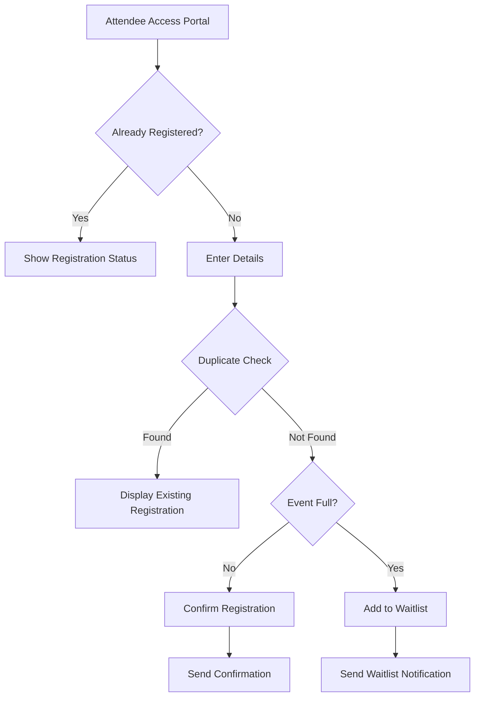
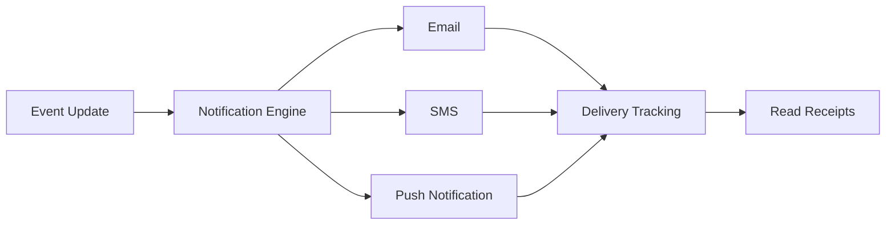
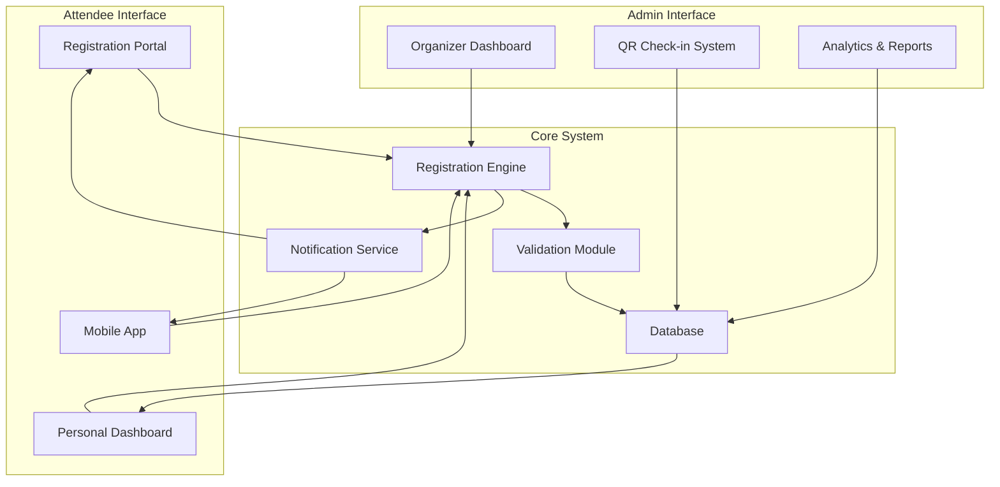

# manages event registrations

**Problem Statement:**

A college currently manages **event registrations** through Google Forms and email confirmations. Students face issues such as duplicate entries, no real-time status updates, and last-minute communication gaps.

---

# Problem Summary

Event organizers currently rely on Google Forms and email confirmations for event registrations, leading to several operational challenges:

- **Duplicate entries:** Participants accidentally register multiple times due to lack of system validation
- **No real-time status updates:** Attendees cannot track their registration status or receive instant confirmation
- **Last-minute communication gaps:** Important updates about event changes, venue modifications, or cancellations don't reach attendees promptly
- **Manual data management:** Event organizers must manually review and deduplicate entries, wasting valuable time
- **Limited capacity management:** No automated system to handle waitlists or notify attendees when spots become available

# Requirement Candidates for Improved Event Registration System

1. **Automated Registration Validation:** The system shall prevent duplicate registrations by checking participant email addresses and ID numbers before allowing form submission, providing immediate feedback if a registration already exists.
2. **Real-Time Status Dashboard:** Attendees shall have access to a personal dashboard showing their registration status (confirmed, waitlisted, or cancelled), event details, and any updates, with instant notifications pushed via email and mobile app.
3. **Instant Communication Channel:** The system shall include a multi-channel notification system (email, SMS, push notifications) that allows organizers to send urgent updates to all registered participants within minutes, with read receipts and delivery confirmations.
4. **Smart Capacity Management:** The system shall automatically manage event capacity limits, create waitlists when events are full, and automatically promote waitlisted attendees when spots become available, sending immediate notifications to affected participants.
5. **Integrated Check-In System:** The system shall provide QR code-based check-in functionality for event day, allowing organizers to quickly verify attendance, track no-shows, and generate real-time attendance reports for event records.

---

# 📊 Interactive System Visualization

<aside>
💡 **Click on the toggles below to explore each component of the improved registration system**

</aside>

### 🔐 User Registration Flow

**Key Features:**

- Real-time duplicate detection
- Instant email confirmation
- Automatic waitlist management

### 📱 Notification System

**Communication Channels:**

- 📧 Email notifications
- 📲 SMS alerts for urgent updates
- 🔔 Mobile push notifications
- ✅ Delivery confirmation tracking

### 🎯 Capacity Management

| **Status** | **Action** | **Notification** |
| --- | --- | --- |
| 🟢 Spots Available | Immediate confirmation | Confirmation email |
| 🟡 Waitlisted | Queue position assigned | Waitlist notification |
| 🔵 Spot Opens | Auto-promote from waitlist | Upgrade notification |
| 🔴 Event Full | Close registration | Full capacity alert |

*The system automatically manages all capacity transitions without manual intervention.*

### 📊 Admin Dashboard

**Real-time metrics available:**

- 👥 Total registrations count
- ⏱️ Waitlist queue length
- ✓ Check-in completion rate
- 📈 Historical attendance trends
- 🚫 Cancellation statistics

**Quick Actions:**

- Broadcast urgent updates to all participants
- Export registration data for records
- Generate QR codes for check-in

## 🔄 Complete System Architecture

<aside>
✨ **Benefits of This Interactive System:** Eliminates manual work, ensures data accuracy, provides instant communication, and creates a seamless experience for both attendees and organizers.

</aside>

- [ ]  Review system architecture with event organizers
- [ ]  Identify technology stack for implementation
- [ ]  Create detailed technical specifications
- [ ]  Develop prototype for user testing